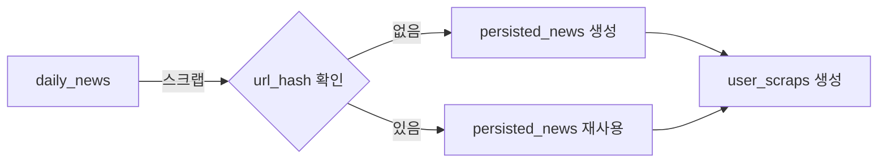
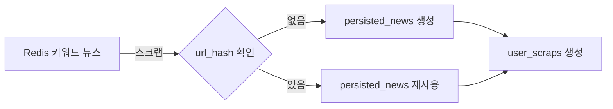
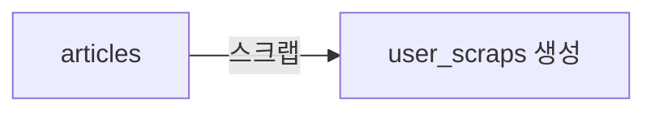
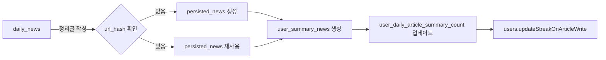
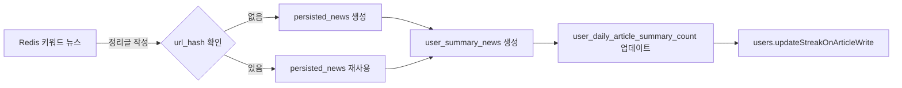
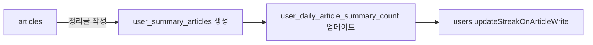
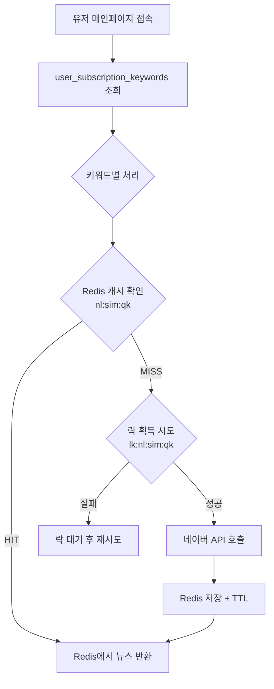

# Newsbara 데이터베이스 구조 및 플로우

## 1. 전체 테이블 구조 (10개)

### 데이터 소스 (4개)
- `daily_news` - 주요 뉴스 (MySQL, 임시, 주기 삭제)
- **Redis** - 키워드 기반 뉴스 (네이버 API, 임시, TTL)
- `articles` - 아티클 (MySQL, 영구 보관)
- `article_sources` - 아티클 출처

### 영구 보관 (1개)
- `persisted_news` - 스크랩/정리된 뉴스 영구 보관

### 사용자 관련 (6개)
- `users` - 사용자
- `user_scraps` - 스크랩
- `user_summary_news` - 뉴스 정리글
- `user_summary_articles` - 아티클 정리글
- `user_daily_article_summary_count` - 일일 정리 카운트
- `user_subscription_keywords` - 구독 키워드

---

## 2. 데이터 플로우

### 뉴스 출처 3가지
1. **주요 뉴스** - `daily_news` (MySQL, 크롤러 수집)
2. **키워드 뉴스** - Redis (네이버 API, 유저별 키워드)
3. **아티클** - `articles` (MySQL, 크롤러 수집)

---

### 2.1.1. 주요 뉴스 스크랩 플로우 (daily_news → MySQL)



**단계별 처리:**
1. 유저가 `daily_news`에서 뉴스 선택
2. `url_hash`로 `persisted_news` 존재 확인
   - 없으면: `daily_news` → `persisted_news` 복사 생성
   - 있으면: 기존 `persisted_news` 재사용
3. `user_scraps` 생성
   ```
   - user_id: 사용자 FK
   - content_type: 'NEWS'
   - persisted_news_id: FK
   - memo: 선택적
   ```

---

### 2.1.2. 키워드 뉴스 스크랩 플로우 (Redis → MySQL)



**단계별 처리:**
1. 유저가 메인페이지에서 **키워드 기반 뉴스** 선택 (Redis에서 조회)
2. `url_hash`로 `persisted_news` 존재 확인
   - 없으면: Redis 뉴스 데이터 → `persisted_news` 생성
   - 있으면: 기존 `persisted_news` 재사용
3. `user_scraps` 생성 (주요 뉴스와 동일)

> **중요**: Redis 임시 데이터도 스크랩 시 MySQL `persisted_news`로 영구 보관!

---

### 2.2. 아티클 스크랩 플로우



**단계별 처리:**
1. 유저가 `articles`에서 아티클 선택
2. `user_scraps` 바로 생성
   ```
   - user_id: 사용자 FK
   - content_type: 'ARTICLE'
   - article_id: articles FK (직접 참조)
   - memo: 선택적
   ```

> **중요**: articles는 영구 보관되므로 복사 없이 직접 참조!

---

### 2.3.1. 주요 뉴스 정리글 작성 플로우 (daily_news → MySQL)



**단계별 처리:**
1. 유저가 `daily_news`에서 뉴스 선택하여 정리글 작성
2. `url_hash`로 `persisted_news` 존재 확인
   - 없으면: `daily_news` → `persisted_news` 복사 생성
   - 있으면: 기존 `persisted_news` 재사용
3. `user_summary_news` 생성
   ```
   - user_id: 사용자 FK
   - persisted_news_id: FK
   - title: 정리글 제목
   - content: 정리글 내용
   - is_public: 공개 여부
   - tags: 태그
   ```
4. `user_daily_article_summary_count` 업데이트
   ```
   - 오늘(유저 타임존 기준) row 조회
   - 없으면: 새 row 생성 (count=1)
   - 있으면: count++
   ```
5. `users.updateStreakOnArticleWrite()` 호출
   ```
   - 같은 날 (today == last_active_ymd): 스트릭 유지
   - 다음 날 (today == last_active_ymd + 1): current_streak++
   - 그 외: current_streak = 1
   - best_streak = max(best_streak, current_streak)
   ```

---

### 2.3.2. 키워드 뉴스 정리글 작성 플로우 (Redis → MySQL)



**단계별 처리:**
1. 유저가 메인페이지 **키워드 기반 뉴스**에서 선택하여 정리글 작성
2. `url_hash`로 `persisted_news` 존재 확인
   - 없으면: Redis 뉴스 데이터 → `persisted_news` 생성
   - 있으면: 기존 `persisted_news` 재사용
3. `user_summary_news` 생성 (주요 뉴스와 동일)
4. `user_daily_article_summary_count` 업데이트 (동일)
5. `users.updateStreakOnArticleWrite()` 호출 (동일)

> **중요**: Redis 뉴스도 정리글 작성 시 MySQL `persisted_news`로 영구 보관!

---

### 2.4. 아티클 정리글 작성 플로우



**단계별 처리:**
1. 유저가 `articles`에서 아티클 선택하여 정리글 작성
2. `user_summary_articles` 생성
   ```
   - user_id: 사용자 FK
   - article_id: articles FK (직접 참조)
   - title: 정리글 제목
   - content: 정리글 내용
   - is_public: 공개 여부
   - tags: 태그
   ```
3. `user_daily_article_summary_count` 업데이트 (뉴스와 동일)
4. `users.updateStreakOnArticleWrite()` 호출 (뉴스와 동일)

---

## 3. 핵심 차이점

| 항목         | 뉴스 (News)                     | 아티클 (Article)      |
| ---------- | ----------------------------- | ------------------ |
| **임시 데이터** | `daily_news` (주기 삭제)          | -                  |
| **영구 데이터** | `persisted_news` (유저 액션 시 생성) | `articles` (이미 영구) |
| **스크랩 참조** | `persisted_news_id`           | `article_id`       |
| **정리글 참조** | `persisted_news_id`           | `article_id`       |
| **복사 발생**  | Yes (임시→영구)                   | No (직접 참조)         |

---

## 4. 전체 데이터 관계도

```
┌──────────────────────────────────────────────────────────┐
│                      데이터 소스                         │
└──────────────────────────────────────────────────────────┘

[MySQL - 주요 뉴스]              [Redis - 키워드 뉴스]
┌─────────────────┐              ┌─────────────────────┐
│   daily_news    │              │ nl:{sort}:{qk}      │
│  (크롤러 수집)  │              │ (네이버 API)        │
│  (주기 삭제)    │              │ (TTL: 5~60분)       │
└────────┬────────┘              └──────────┬──────────┘
         │                                  │
         └────────── 스크랩/정리 시 ────────┘
                          ↓
                 ┌─────────────────┐
                 │ persisted_news  │ MySQL 영구 보관
                 │ (url_hash 유니크)│
                 └────────┬────────┘
                          │
         ┌────────────────┴─────────────────┐
         │                                  │
    user_scraps                    user_summary_news
   (스크랩 목록)                      (정리글)


[MySQL - 아티클]
┌─────────────────┐
│ article_sources │ 출처
└────────┬────────┘
         │ FK
         ↓
┌─────────────────┐
│    articles     │ 크롤러가 수집 (영구 보관)
└────────┬────────┘
         │
         ├──→ user_scraps (직접 참조)
         └──→ user_summary_articles (직접 참조)


[사용자 데이터]
┌─────────────┐
│   users     │
└──────┬──────┘
       │
       ├─── user_subscription_keywords (구독 키워드)
       │         ↓
       │    네이버 API 호출 → Redis 캐싱
       │
       ├─── user_daily_article_summary_count (캘린더, KST)
       │
       ├─── user_scraps
       │    ├─── persisted_news (뉴스)
       │    └─── articles (아티클)
       │
       ├─── user_summary_news
       │    └─── persisted_news (뉴스 원본)
       │
       └─── user_summary_articles
            └─── articles (아티클 원본)
```

---

## 5. 중복 방지 전략

### 5.1. 뉴스 (3가지 출처 → 1개 테이블)
```
출처 1: daily_news (MySQL)        ─┐
출처 2: Redis 키워드 뉴스          ├→ persisted_news (url_hash 유니크)
출처 3: 다른 유저가 이미 저장     ─┘
```
- `persisted_news.url_hash` UNIQUE 제약
- **같은 URL**을 여러 출처/여러 유저가 스크랩/정리해도 `persisted_news`는 **1개만** 존재
- `user_scraps`, `user_summary_news`는 각 유저마다 생성

### 5.2. 아티클
- `articles.url_hash` UNIQUE 제약
- 크롤러가 수집 시 중복 체크
- 유저는 기존 `articles`를 직접 참조

### 5.3. Redis 캐시 중복 방지
- **락 키 사용**: 동시 요청 시 1명만 API 호출
- **키워드 해시**: 같은 키워드 = 같은 캐시 키 (`qk`)

---

## 6. 타임존 처리

| 컬럼 | 타임존 | 설명 |
|------|--------|------|
| `created_at` | **UTC** | 모든 테이블 공통 |
| `updated_at` | **UTC** | 모든 테이블 공통 |
| `deleted_at` | **UTC** | 탈퇴 시각 |
| `last_crawled_at` | **UTC** | 크롤링 시각 |
| `pub_date` | **원본** | 뉴스 발행일 (RSS 그대로) |
| `published_at` | **원본** | 아티클 발행일 (크롤러 그대로) |
| `last_active_ymd` | **KST** | 유저 마지막 활동 날짜 |
| `summary_date` | **KST** | 유저 정리 날짜 |

---

## 7. 스트릭 시스템

### 7.1. 업데이트 로직
```java
user.updateStreakOnArticleWrite()
```

| 조건 | 동작 |
|------|------|
| 첫 작성 | `current_streak = 1`, `best_streak = 1` |
| 같은 날 (ymd == last_active_ymd) | 스트릭 유지 |
| 다음 날 (ymd == last_active_ymd + 1) | `current_streak++` |
| 그 외 (2일 이상 띄움) | `current_streak = 1` |
| 매번 | `best_streak = max(best_streak, current_streak)` |

### 7.2. 초기화 로직 (스케줄러)
```java
user.checkAndResetStreak()
```
- 마지막 활동일이 어제가 아니면 `current_streak = 0`
- 유저 타임존마다 별도 스케줄러 필요

---

## 8. Redis 캐싱 전략 (네이버 API)

### 8.1. 메인 페이지 뉴스 노출



**플로우:**
1. 유저의 구독 키워드 목록 조회 (`user_subscription_keywords`)
2. 각 키워드별로:
   - 키워드 정규화 → 해시 생성 (`qk`)
   - Redis 키: `nl:{sort}:{qk}` 확인
   - **캐시 HIT**: Redis에서 뉴스 리스트 반환
   - **캐시 MISS**: 
     - 락 획득 (`lk:nl:{sort}:{qk}`)
     - 네이버 API 호출 (1명만)
     - Redis 저장 + TTL 설정
     - 다른 유저는 락 대기 후 캐시에서 조회

---

### 8.2. Redis 키 구조

#### 8.2.1. 뉴스 리스트 캐시
```
키: nl:{sort}:{qk}
```
- `{sort}`: 정렬 방식
  - `sim` - 정확도순 (TTL: 30~60분)
  - `date` - 최신순 (TTL: 5~15분)
- `{qk}`: 키워드 정규화 후 해시값
- **값**: 뉴스 배열 (JSON or MessagePack)
- **저장 개수**: 키워드당 20~50개

**예시:**
```
nl:sim:9f2a3b4c... → [{title, url, press, pubDate, ...}, ...]
nl:date:9f2a3b4c... → [{...}, ...]
```

#### 8.2.2. 썸네일 캐시
```
키: th:{urlHash}
```
- `{urlHash}`: URL 해시값
- **값**: JSON
  ```json
  // 성공 시
  { "s": "OK", "u": "https://...", "ts": 1705123456 }
  
  // 실패 시
  { "s": "FAIL", "ra": 1705123456 }
  ```
- **TTL**:
  - OK: 1~7일
  - FAIL: 1~6시간 (retryAfter)

#### 8.2.3. 락 키 (스탬피드 방지)
```
리스트 갱신: lk:nl:{sort}:{qk}
썸네일 생성: lk:th:{urlHash}
```
- **TTL**: 
  - 뉴스 리스트: 10~30초
  - 썸네일: 30~120초
- **목적**: 동시 요청 시 1명만 API/파싱 수행

#### 8.2.4. 도메인 → 언론사 매핑 (선택)
```
키: pub:host:{host}
```
- **예시**: `pub:host:sedaily.com` → `"서울경제"`
- **값**: `{name, logoUrl, updatedAt}`
- **TTL**: 30~180일 (영구 가능)

#### 8.2.5. 유저 키워드 목록 캐시 (선택)
```
키: u:{userId}:kw
```
- **값**: 유저 키워드 배열 (JSON)
- **TTL**: 1~6시간 (또는 이벤트 기반 무효화)
- **목적**: DB 쿼리 최소화

---

### 8.3. 종합: 3가지 뉴스 소스 처리

| 출처 | 위치 | 스크랩/정리 시 |
|------|------|---------------|
| 주요 뉴스 | MySQL (`daily_news`) | → `persisted_news` |
| 키워드 뉴스 | Redis (네이버 API) | → `persisted_news` |
| 결과 | 모두 | → `persisted_news` (url_hash 유니크) |

> **핵심**: 어떤 출처든 최종적으로 `persisted_news`에 영구 보관!

---

##  9. 데이터 생명주기

### 9.1. 영구 보관
- `users`
- `articles` (삭제 안함)
- `article_sources`
-  `persisted_news`
-  `user_scraps`
-  `user_summary_news`
-  `user_summary_articles`
-  `user_daily_article_summary_count`
-  `user_subscription_keywords`

### 9.2. 주기 삭제
-  `daily_news` (N일 이전 데이터 삭제)
-  Redis 캐시 (TTL 설정)

---

## 10. 요약

### 10.1. 데이터 소스 → 영구 보관 흐름
```
뉴스:
  - daily_news (MySQL, 주기 삭제)  ─┐
  - Redis (네이버 API, TTL)        ├→ persisted_news (영구)
                                    │
아티클:
  - articles (MySQL, 영구)         → 직접 참조
```

### 10.2. 핵심 정리
1. **뉴스 3가지 출처**: MySQL 주요 뉴스 + Redis 키워드 뉴스 + 기존 영구 뉴스
2. **모든 뉴스**: 스크랩/정리 시 → `persisted_news` 영구 보관
3. **아티클**: 이미 영구 보관 → 직접 참조
4. **Redis 역할**: 
   - 네이버 API 응답 캐싱 (TTL)
   - 락으로 API 호출 최소화
   - 썸네일 메타데이터 캐싱
5. **스크랩**: 원본 보관 후 `user_scraps` 생성
6. **정리글**: 원본 보관 후 `user_summary_*` 생성 + 스트릭 갱신
7. **중복 방지**: `url_hash` 유니크 제약
8. **타임존**: UTC (시스템) vs KST (유저)
