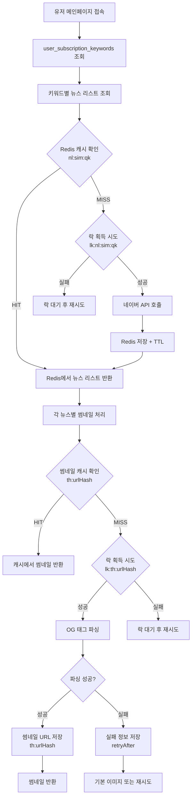
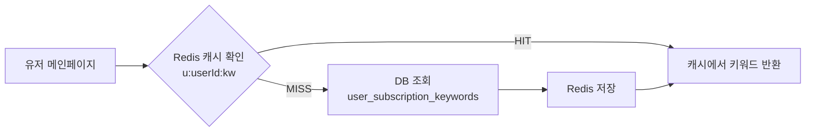
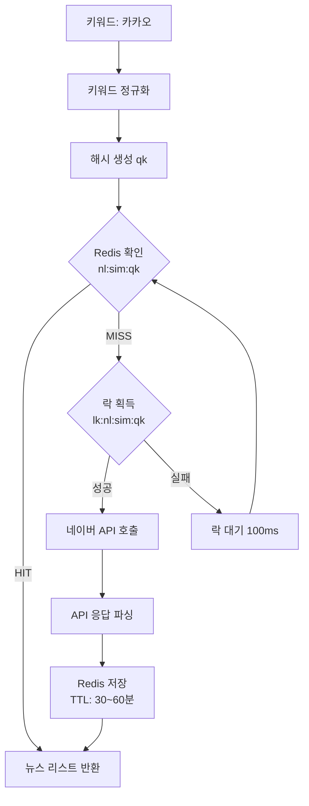
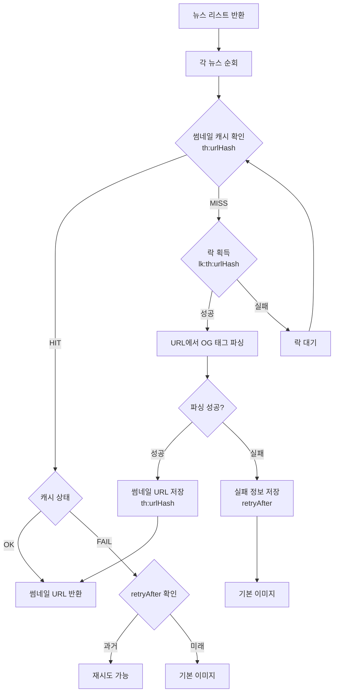
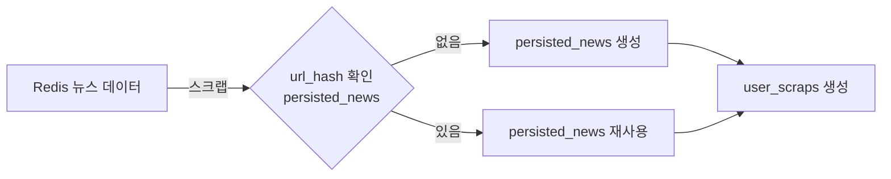
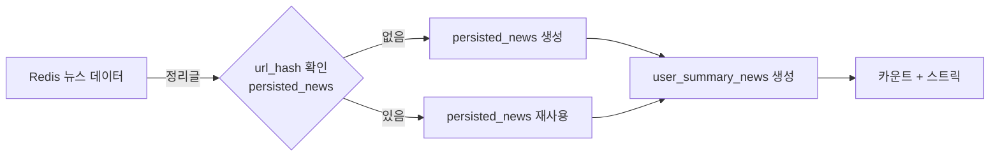

# 키워드 뉴스 검색 및 썸네일 처리 플로우

## 개요

유저가 메인페이지에서 구독한 키워드로 뉴스를 검색하고, 각 뉴스의 썸네일을 가져오는 전체 플로우를 설명합니다.
네이버 뉴스 API 리턴값에는 이미지가 없다.

---

## 전체 플로우 다이어그램



---

## 단계별 상세 플로우

### 1단계: 유저 키워드 조회



**처리:**
1. 유저 메인페이지 접속
2. Redis 키 `u:{userId}:kw` 확인
   - **HIT**: 캐시에서 키워드 목록 반환
   - **MISS**: MySQL `user_subscription_keywords` 조회
   - Redis 저장 (TTL: 1~6시간)

**예시:**
```json
// u:123:kw
["카카오", "삼성전자", "응가"]
```

---

### 2단계: 키워드별 뉴스 리스트 조회



**처리:**
1. 각 키워드별로:
   - 키워드 정규화 (공백 제거, 소문자 변환 등)
   - 해시 생성 → `qk` (예: `9f2a3b4c...`)
2. Redis 키 `nl:sim:{qk}` 확인
   - **HIT**: 캐시에서 뉴스 리스트 반환
   - **MISS**: 
     - 락 키 `lk:nl:sim:{qk}` 획득 시도
     - **락 성공**: 네이버 API 호출
     - **락 실패**: 락 대기 후 재시도
3. 네이버 API 호출 성공 시:
   - 응답 파싱 (제목, URL, 언론사, 발행일 등)
   - Redis 저장: `nl:sim:{qk}` (TTL: 30~60분)
   - 락 해제

**Redis 키 구조:**
```
nl:sim:9f2a3b4c... → [
  {
    "title": "카카오, AI 기술 발표",
    "url": "https://...",
    "press": "조선일보",
    "pubDate": "2026-01-10T10:00:00",
    "urlHash": "ab12cd34..."
  },
  ...
]
```

**락 메커니즘:**
- **목적**: 여러 유저가 동시에 같은 키워드 검색 시 API 호출 1번만
- **TTL**: 10~30초
- **락 실패 시**: 짧은 대기 후 재시도 (캐시 HIT 기대)

---

### 3단계: 각 뉴스별 썸네일 처리



**처리:**
1. 뉴스 리스트의 각 뉴스에 대해:
   - `urlHash` 계산 (또는 API에서 제공)
   - Redis 키 `th:{urlHash}` 확인

2. **캐시 HIT 시:**
   ```json
   // 성공 케이스
   {
     "s": "OK",
     "u": "https://example.com/image.jpg",
     "ts": 1705123456
   }
   ```
   - 썸네일 URL 반환

   ```json
   // 실패 케이스
   {
     "s": "FAIL",
     "ra": 1705123456  // retryAfter (epoch)
   }
   ```
   - `retryAfter` 확인
   - 과거면 재시도 가능 (락 획득 후 재파싱)
   - 미래면 기본 이미지 반환

3. **캐시 MISS 시:**
   - 락 키 `lk:th:{urlHash}` 획득 시도
   - **락 성공**: 
     - 뉴스 URL에서 OG 태그 파싱
     - `<meta property="og:image" content="...">` 추출
     - 성공 시: `th:{urlHash}` 저장 (TTL: 1~7일)
     - 실패 시: `th:{urlHash}` 저장 (TTL: 1~6시간, retryAfter 포함)
   - **락 실패**: 락 대기 후 재시도 (캐시 HIT 기대)

**썸네일 캐시 구조:**
```
th:ab12cd34... → {
  "s": "OK",
  "u": "https://example.com/thumb.jpg",
  "ts": 1705123456
}
```

**락 메커니즘:**
- **목적**: 여러 클라이언트가 동시에 같은 뉴스 썸네일 요청 시 파싱 1번만
- **TTL**: 30~120초
- **락 실패 시**: 짧은 대기 후 재시도 (다른 요청이 파싱 완료 기대)

---

## Redis 키 정리

### 뉴스 리스트 캐시
```
키: nl:{sort}:{qk}
```
- `{sort}`: `sim` (정확도순) 또는 `date` (최신순)
- `{qk}`: 키워드 정규화 후 해시값
- **값**: 뉴스 배열 (JSON or MessagePack)
- **TTL**: 
  - `sim`: 30~60분
  - `date`: 5~15분
- **저장 개수**: 키워드당 20~50개

### 썸네일 캐시
```
키: th:{urlHash}
```
- `{urlHash}`: URL 해시값 (SHA-256)
- **값**: JSON
  ```json
  // 성공
  { "s": "OK", "u": "https://...", "ts": 1705123456 }
  
  // 실패
  { "s": "FAIL", "ra": 1705123456 }
  ```
- **TTL**:
  - OK: 1~7일
  - FAIL: 1~6시간

### 락 키
```
리스트 갱신: lk:nl:{sort}:{qk}
썸네일 생성: lk:th:{urlHash}
```
- **TTL**: 
  - 리스트: 10~30초
  - 썸네일: 30~120초
- **목적**: 동시 요청 시 1명만 API/파싱 수행

### 유저 키워드 목록 (선택)
```
키: u:{userId}:kw
```
- **값**: 키워드 배열 (JSON)
- **TTL**: 1~6시간

### 도메인 → 언론사 매핑 (선택)
```
키: pub:host:{host}
```
- **예시**: `pub:host:sedaily.com` → `"서울경제"`
- **TTL**: 30~180일

---

## 최적화 포인트

### 1. API 호출 최소화
- 락으로 동시 요청 시 1번만 호출
- 캐시 TTL로 적절한 갱신 주기
- 여러 유저가 같은 키워드 구독 시 캐시 공유

### 2. 썸네일 파싱 최소화
- 락으로 동시 요청 시 1번만 파싱
- 실패 시 retryAfter로 불필요한 재시도 방지
- 긴 TTL로 성공한 썸네일은 오래 캐싱

### 3. DB 쿼리 최소화
- 유저 키워드 목록 캐싱
- 도메인→언론사 매핑 캐싱

---

## 성능 시나리오

### 시나리오 1: 첫 유저 (캐시 MISS)
```
1. 키워드 조회: DB 쿼리 (1회)
2. 뉴스 리스트: 네이버 API 호출 (1회)
3. 썸네일: OG 파싱 (N회, N=뉴스 개수)
총 시간: ~2~5초
```

### 시나리오 2: 동시 유저들 (캐시 MISS, 락 경쟁)
```
유저 A: 락 획득 → API 호출 → 캐시 저장
유저 B: 락 실패 → 대기 → 캐시 HIT
유저 C: 락 실패 → 대기 → 캐시 HIT
총 API 호출: 1회 (유저 A만)
```

### 시나리오 3: 캐시 HIT (일반적인 경우)
```
1. 키워드 조회: Redis (1ms)
2. 뉴스 리스트: Redis (1ms)
3. 썸네일: Redis (N회, 각 1ms)
총 시간: ~50~100ms
```

---

## 스크랩/정리 시 영구 보관 플로우

### 키워드 뉴스 스크랩



**처리:**
1. Redis에서 뉴스 데이터 조회 (이미 메모리에 있음)
2. MySQL `persisted_news` 중복 확인 (`url_hash`)
3. 없으면: Redis 데이터 → `persisted_news` 생성
4. 있으면: 기존 `persisted_news` 재사용
5. `user_scraps` 생성

### 키워드 뉴스 정리글 작성



**처리:**
1. Redis에서 뉴스 데이터 조회
2. MySQL `persisted_news` 중복 확인
3. 없으면: Redis → MySQL 복사
4. `user_summary_news` 생성
5. `user_daily_article_summary_count` 업데이트
6. 스트릭 갱신

> **핵심**: Redis 임시 데이터도 유저 액션 시 MySQL `persisted_news`로 영구 보관!

---

## 요약

1. **키워드 조회**: Redis 캐싱으로 DB 쿼리 최소화
2. **뉴스 리스트**: 네이버 API → Redis 캐싱 (락으로 중복 호출 방지)
3. **썸네일**: OG 파싱 → Redis 캐싱 (락으로 중복 파싱 방지)
4. **스크랩/정리**: Redis → MySQL `persisted_news` 영구 보관
5. **최적화**: 락 + 캐시로 API 호출 및 파싱 최소화
