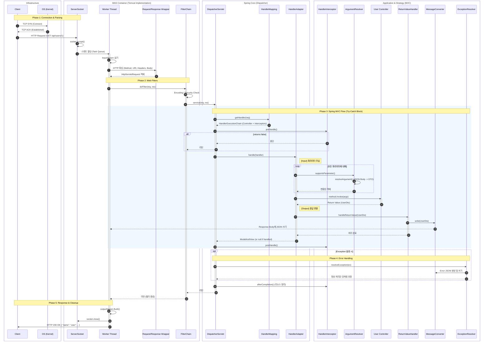

```mermaid
sequenceDiagram
    autonumber
    
    box Infrastructure
        participant User as Client
        participant OS as OS (Kernel)
    end

    box WAS Container (Tomcat Implementation)
        participant Server as ServerSocket
        participant Thread as Worker Thread
        participant Request as Request/Response Wrapper
        participant Filter as FilterChain
    end

    box Spring Core (Dispatcher)
        participant Dispatcher as DispatcherServlet
        participant Mapping as HandlerMapping
        participant Adapter as HandlerAdapter
    end

    box Application & Strategy (MVC)
        participant Interceptor as HandlerInterceptor
        participant Resolver as ArgumentResolver
        participant Controller as User Controller
        participant ReturnHandler as ReturnValueHandler
        participant Converter as MessageConverter
        participant ExResolver as ExceptionResolver
    end

    %% 1. Connection & Threading
    Note over User, Server: Phase 1: Connection & Parsing
    User->>OS: TCP SYN (Connect)
    OS-->>User: TCP ACK (Established)
    User->>Server: HTTP Request (GET /api/users/1)
    
    Server->>Server: socket.accept()
    Server->>Thread: 스레드 할당 (Task Queue)
    
    activate Thread
    Thread->>Thread: InputStream 읽기
    Thread->>Request: HTTP 파싱 (Method, URI, Headers, Body)
    activate Request
    Request-->>Thread: HttpServletRequest 객체
    deactivate Request

    %% 2. Filter Chain
    Note over Thread, Filter: Phase 2: Web Filters
    Thread->>Filter: doFilter(req, res)
    activate Filter
    Filter->>Filter: Encoding / Security Check
    
    %% 3. Dispatcher Entry
    Filter->>Dispatcher: service(req, res)
    activate Dispatcher
    
    rect rgb(240, 248, 255)
        Note over Dispatcher, ExResolver: Phase 3: Spring MVC Flow (Try-Catch Block)
        
        %% 3-1. Mapping
        Dispatcher->>Mapping: getHandler(req)
        Mapping-->>Dispatcher: HandlerExecutionChain (Controller + Interceptors)

        %% 3-2. Interceptor PreHandle
        Dispatcher->>Interceptor: preHandle()
        alt returns false
            Interceptor-->>Dispatcher: 중단
            Dispatcher-->>Filter: 리턴
        end

        %% 3-3. Adapter Execution
        Dispatcher->>Adapter: handle(handler)
        activate Adapter
        
        %% 3-4. Argument Resolution (Input Magic)
        Note right of Adapter: [Input] 파라미터 주입
        loop 모든 파라미터에 대해
            Adapter->>Resolver: supportsParameter()
            Resolver->>Resolver: resolveArgument() (JSON Body -> DTO)
            Resolver-->>Adapter: 변환된 객체
        end

        %% 3-5. Controller Logic
        Adapter->>Controller: method.invoke(args)
        activate Controller
        Controller-->>Adapter: Return Value (UserDto)
        deactivate Controller

        %% 3-6. Return Value Handling (Output Magic)
        Note right of Adapter: [Output] 응답 변환
        Adapter->>ReturnHandler: handleReturnValue(UserDto)
        activate ReturnHandler
        ReturnHandler->>Converter: write(UserDto)
        Converter-->>Thread: Response Body에 JSON 쓰기
        ReturnHandler-->>Adapter: 처리 완료
        deactivate ReturnHandler

        Adapter-->>Dispatcher: ModelAndView (or null if handled)
        deactivate Adapter

        %% 3-7. Interceptor PostHandle
        Dispatcher->>Interceptor: postHandle()
    end

    %% 4. Exception Handling
    opt Exception 발생 시
        Note over Dispatcher, ExResolver: Phase 4: Error Handling
        Dispatcher->>ExResolver: resolveException(ex)
        ExResolver->>Converter: Error JSON 생성 및 쓰기
        ExResolver-->>Dispatcher: 정상 처리된 것처럼 위장
    end

    %% 5. Completion
    Dispatcher->>Interceptor: afterCompletion() (리소스 정리)
    Dispatcher-->>Filter: 리턴
    deactivate Dispatcher

    Filter-->>Thread: 리턴 (필터 종료)
    deactivate Filter

    Note over Thread, User: Phase 5: Response & Cleanup
    Thread->>Thread: outputStream.flush()
    Thread->>Server: socket.close()
    Thread->>User: HTTP 200 OK { "name": "user" ... }
    deactivate Thread
```

